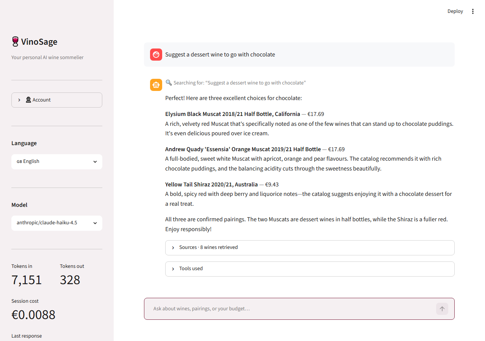

# VinoSage

## What this is

A domain-specialised RAG chatbot for an online wine shop.
Recommends, compares, and budgets wines from a live 1289-item catalog
using a LangChain tool-calling agent with 5 specialised tools and
multi-query RAG with RRF fusion.

Supports 4 languages (EN / DE / RU / FI), includes rate limiting,
daily cost caps, and full observability logging to Supabase.

Stack: Python · Streamlit · LangChain + LangGraph · Supabase pgvector ·
OpenRouter · Pydantic v2 · rapidfuzz · pytest



---

## Architecture

```
User (Streamlit UI)
       │
       ▼
  app.py  ──► rate_limit.py ──► guard: 10 req/min, €1/day cap
       │
       ▼
  agent.py  ──► LangGraph tool-calling agent (OpenRouter LLM)
       │              │
       │              ├── filter_wines      (hard constraints)
       │              ├── pair_with_food    (dish → wine type)
       │              ├── calculate_budget  (N bottles / €budget)
       │              ├── compare_wines     (fuzzy name match)
       │              └── wine_stats        (aggregates)
       │
       ▼
   rag.py  ──► multi-query translation + self-query filter + RRF fusion
       │
       ▼
  Supabase pgvector  ──► match_wines() RPC (HNSW cosine similarity)
       │
       ▼
  logging_db.py  ──► query_logs / tool_call_logs / token_usage
```

**Stack:** Python 3.14 · Streamlit · LangChain 1.x + LangGraph · OpenRouter · Supabase pgvector · Pydantic v2 · rapidfuzz

---

## Prerequisites

| Tool | Notes |
|------|-------|
| Python 3.14+ | `python --version` |
| Supabase project | Free tier works — needs pgvector extension |
| OpenRouter API key | [openrouter.ai](https://openrouter.ai) |

---

## Quick Start

```bash
# 1. Clone and enter directory
git clone <repo-url>
cd vinosage

# 2. Install dependencies
pip install -r requirements.txt

# 3. Configure secrets
cp .env.example .env
# Edit .env — fill in all required values (see table below)

# 4. Apply database schema
python scripts/apply_sql.py

# 5. Seed catalog (1289 wines → embed)
python scripts/seed.py

# 6. Run the app
streamlit run app.py
```

The app opens at **http://localhost:8501**.
Default admin password is set in `.env` → `ADMIN_PASSWORD`.

---

## Environment Variables

Copy `.env.example` to `.env` and fill in every value.

| Variable | Required | Description |
|----------|----------|-------------|
| `OPENROUTER_API_KEY` | ✓ | OpenRouter API key |
| `SUPABASE_URL` | ✓ | Supabase project URL (`https://<ref>.supabase.co`) |
| `SUPABASE_ANON_KEY` | ✓ | Supabase anon/public key |
| `SUPABASE_SERVICE_KEY` | ✓ | Supabase service role key (used for DB writes) |
| `ADMIN_PASSWORD` | ✓ | Password for the admin panel in the sidebar |
| `OPENROUTER_MODEL` | – | Default chat model (default: `anthropic/claude-haiku-4.5`) |
| `EMBEDDING_MODEL` | – | Embedding model (default: `openai/text-embedding-3-small`) |
| `RATE_LIMIT_PER_MIN` | – | Max requests per minute per session (default: `10`) |
| `DAILY_COST_CAP_EUR` | – | Daily LLM cost cap in EUR (default: `1.00`) |

---

## Database Setup

Applies three SQL files to your Supabase project via the Management API.
Requires `SUPABASE_ACCESS_TOKEN` (create at https://supabase.com/dashboard/account/tokens)
and `SUPABASE_PROJECT_REF` (the `<ref>` in `https://<ref>.supabase.co`) — set both in `.env`.

```bash
python scripts/apply_sql.py
```

What it creates:
- `wines` table with pgvector column + HNSW index
- `query_logs`, `tool_call_logs`, `token_usage`, `rate_limit`, `catalog_audit` tables
- Row Level Security policies (anon: read-only; service role: all)
- `match_wines()` RPC for semantic search
- `flag_wine_embedding()` trigger (re-embeds on content change)
- `bulk_update_embeddings()` helper function

---

## Seed Catalog

```bash
# Full run: sync CSV → upsert → embed stale wines
python scripts/seed.py

# Preview only (no writes)
python scripts/seed.py --dry-run

# Sync catalog only, skip embedding
python scripts/seed.py --skip-embed
```

Embedding 1289 wines takes ~3 minutes (OpenRouter rate limits permitting).
Re-runs are idempotent — only wines with changed content are re-embedded.

---

## Running Tests

```bash
# Unit tests (no API calls — mocks only)
pytest

# Unit tests with verbose output
pytest -v

# Integration / eval tests (requires real API + seeded DB)
pytest -m integration

# All tests
pytest -m "integration or not integration"
```

Unit tests cover all 5 tools + RAG components + i18n — 69 tests, ~5 s.
Integration eval tests (US-001..011 + 8 edge cases) are excluded by default.

---

## Deploy to Streamlit Cloud

1. Push the repo to GitHub.
2. Go to [share.streamlit.io](https://share.streamlit.io) → **New app**.
3. Set **Main file path**: `app.py`.
4. Open **Advanced settings → Secrets** and paste:

```toml
OPENROUTER_API_KEY   = "sk-or-v1-..."
SUPABASE_URL         = "https://<ref>.supabase.co"
SUPABASE_ANON_KEY    = "eyJ..."
SUPABASE_SERVICE_KEY = "eyJ..."
ADMIN_PASSWORD       = "your-password"
OPENROUTER_MODEL     = "anthropic/claude-haiku-4.5"
EMBEDDING_MODEL      = "openai/text-embedding-3-small"
RATE_LIMIT_PER_MIN   = "10"
DAILY_COST_CAP_EUR   = "1.00"
```

5. Click **Deploy**.

Streamlit Cloud sets these as environment variables, which `src/config.py` reads via `os.getenv()`.

---

## Cron: Reconcile Embeddings

`.github/workflows/reconcile.yml` runs every night at 03:00 UTC.
It calls `scripts/seed.py` which:
1. Re-upserts `data/WineDataset.csv` (idempotent)
2. Embeds any wines where `needs_embedding = true`

To trigger manually: **Actions → Reconcile catalog → Run workflow**.

Required GitHub Secrets (same names as `.env`):
`OPENROUTER_API_KEY`, `SUPABASE_URL`, `SUPABASE_ANON_KEY`, `SUPABASE_SERVICE_KEY`, `ADMIN_PASSWORD`.

---

## Project Structure

```
vinosage/
├── app.py                    # Streamlit entrypoint
├── requirements.txt
├── pytest.ini
│
├── src/
│   ├── config.py             # All secrets + model registry
│   ├── catalog.py            # DataFrame cache (anon + service DB)
│   ├── ingest.py             # CSV normalisation + upsert
│   ├── embeddings.py         # OpenRouter embeddings + reconcile
│   ├── rag.py                # Multi-query + RRF retrieval
│   ├── llm.py                # LLM factory (OpenRouter via LangChain)
│   ├── agent.py              # LangGraph tool-calling agent
│   ├── i18n.py               # t(key, locale) translation helper
│   ├── ratelimit.py          # Sliding-window rate limit + cost cap
│   ├── logging_db.py         # Observability writes to Supabase
│   └── tools/
│       ├── filter_wines.py
│       ├── pair_with_food.py
│       ├── calculate_budget.py
│       ├── compare_wines.py
│       └── wine_stats.py
│   └── ui/
│       ├── chat_view.py
│       ├── sidebar.py
│       └── admin.py
│
├── scripts/
│   ├── apply_sql.py          # Apply SQL migrations via Management API
│   └── seed.py               # Full catalog sync + embed
│
├── sql/
│   ├── 01_schema.sql
│   ├── 02_rls.sql
│   └── 03_functions_triggers.sql
│
├── locales/
│   ├── en.json
│   ├── de.json
│   ├── ru.json
│   └── fi.json
│
├── data/
│   └── WineDataset.csv       # 1289 wines (source of truth)
│
├── tests/
│   ├── conftest.py
│   ├── test_filter_wines.py
│   ├── test_pair_with_food.py
│   ├── test_calculate_budget.py
│   ├── test_compare_wines.py
│   ├── test_wine_stats.py
│   ├── test_rag.py
│   └── eval/
│       └── test_agent_eval.py  # integration, requires real API
│
└── .github/workflows/
    ├── reconcile.yml         # nightly cron
    └── tests.yml             # CI on push/PR
```

---

## Key Design Decisions

| Decision | Reason |
|----------|--------|
| Money stored as `INTEGER` cents | Avoids float rounding errors in price display/comparison |
| PostgREST vector strings | pgvector requires `"[0.1,...]"` string format, not a JSON array |
| RRF fusion (k=60) | Combines 4 query variants without amplifying noise |
| `precomputed_rag` param | Allows splitting retrieval from agent call for UI progress steps |
| Service role for all writes | RLS enforces read-only on chat path; admin writes audited |
| Logging never blocks chat | All `logging_db` calls swallow exceptions |
